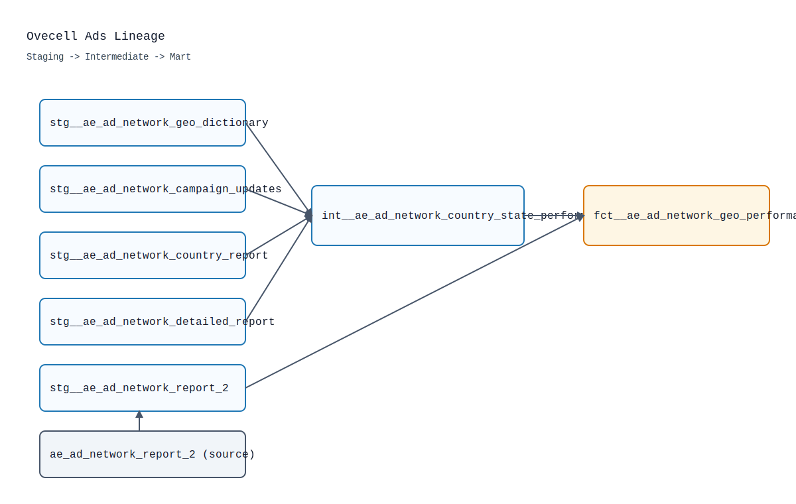

## Ovecell Marketing Analytics Exercise

Welcome! This repository captures the deliverables for the Ovecell Analytics Engineer home assessment. It focuses on building a unified ads performance mart across two third-party ad networks while showcasing dbt best practices, lightweight automation, and analyst-facing documentation.

## Scenario

- Marketing needs a single, geo-aware fact table that blends the disparate export formats from **Ad Network 1** and **Ad Network 2** while preserving the most granular location available.
- An intern has requested feedback on a dimension model (`dim_activity.sql`). Review notes are recorded directly in this repository so the team can reference them alongside the code base.

## Deliverables

1. **Cross-network geo marketing mart** – `models/marts/fct__ae_ad_network_geo_performance.sql` unifies both ad networks, enriches the data with geo dictionary attributes, and standardizes metrics such as CTR, CPC, and CPM. The model is documented in `models/marts/fct__ae_ad_network_geo_performance.yml`.
2. **Intern SQL review summary** – See [Intern Model Review](#intern-model-review) for the feedback provided to the new teammate working on `dim_activity.sql`.

## Source Data

The raw CSVs provided in the brief are registered as dbt sources (see `models/sources.yml`). They include campaign history, geo lookup, country-level performance, detailed (state-level) performance, and the combined Ad Network 2 report. Data definitions align with the `data_schema.md` attachment referenced in the exercise:

| Source table | Brief description |
| --- | --- |
| `ae_ad_network_campaign_updates` | Campaign metadata history (Ad Network 1) |
| `ae_ad_network_geo_dictionary` | Geo dimension with `country_code`, `name`, and `location_type` |
| `ae_ad_network_country_report` | Country-level daily metrics for Ad Network 1 |
| `ae_ad_network_detailed_report` | State-level daily metrics for Ad Network 1 |
| `ae_ad_network_report_2` | Daily metrics for Ad Network 2, already denormalized |

## Data Modeling Approach

The dbt project follows a three-layer convention:

- **Staging (`models/staging/`)** – One model per source table applies renaming, typing, and metadata (e.g., `stg__ae_ad_network_campaign_updates` uses `dbt_utils.deduplicate` to isolate the latest campaign snapshot).
- **Intermediate (`models/intermediate/int__ae_ad_network_country_state_performance.sql`)** – Combines detailed and country-level extracts from Ad Network 1, preferring the most granular geo data available and falling back to country-level rows only when no state-level record exists.
- **Mart (`models/marts/fct__ae_ad_network_geo_performance.sql`)** – Union of Ad Network 1 and 2 data with standardized geo columns, campaign metadata, and calculated KPIs. Ensures marketing receives one consistent table for downstream reporting.

### Lineage Snapshot



### Final Fact Table Cheat Sheet

`fct__ae_ad_network_geo_performance` is the analyst-facing output. Key columns are documented below (full descriptions live alongside the model in YAML):

| Column | Description |
| --- | --- |
| `date` | Snapshot date for the marketing metrics |
| `campaign_id`, `campaign_name` | Campaign identifiers and friendly names |
| `source` | Ad network label (`'Ad Network 1'` or `'Ad Network 2'`) |
| `country_code`, `state_name`, `location_type` | Geo attributes sourced from the dictionary where available |
| `spend`, `impressions`, `clicks` | Raw performance metrics |
| `ctr` | Calculated via `safe_divide(clicks, impressions)` |
| `cpc` | `safe_divide(spend, clicks)` |
| `cpm` | `safe_divide(spend, impressions) * 1000` |
| `loaded_at` | Ingestion timestamp for traceability |

The `safe_divide` macro (see `macros/safe_divide.sql`) guarantees the calculated metrics remain null-safe.

## Testing & Quality Gates

- **Source tests** – Configured in `models/sources.yml` to assert key columns are present and non-null.
- **Model tests** – `models/staging/schema.yml` defines column-level expectations for staging views, while `models/marts/fct__ae_ad_network_geo_performance.yml` validates accepted values and non-negative metrics.
- **Custom data test** – `tests/assert_ctr_formula.sql` re-computes CTR to ensure the metric stored in the mart stays in sync with raw clicks and impressions.

## Utilities & Automation

- `codes/dbt_generate_docs.py` – Convenience wrapper around `dbt ls` and the [`generate_model_yaml`](https://github.com/dbt-labs/dbt-codegen) macro for maintaining schema documentation.
- `codes/dbt_generate_stage_models.py` – Example script that scaffolds staging models with the dbt Codegen package.
- `Makefile` – Handy shortcuts for docs (`make docs`), linting (`make lint` / `make fix`), formatting (`make fmt`), and environment bootstrapping (`make debug`).
- `env_vars.sh` – Shell helper to load credentials like `MOTHERDUCK_TOKEN` prior to running dbt locally.

## Intern Model Review

The intern’s `dim_activity.sql` proposal was reviewed with a focus on clarity, performance, and maintainability. Highlights from the feedback:

- Encourage the use of CTEs scoped to the specific grain (user + event type) to trim redundant joins and window functions.
- Replace repeated subqueries that scan the full events table with filtered staging models or temp tables materialized upstream.
- Suggest leveraging dbt incremental materializations only after the base model is performant; premature incrementals can hide underlying inefficiencies.
- Recommend documenting business rules for “first song”, “last song”, and “challenge play” directly in model descriptions to aid future analysts.

These notes are included here so the marketing and product analytics teams have shared visibility without leaving the repo.

## Getting Started

1. Create and activate a virtual environment (optional but recommended).
   ```bash
   python -m venv .venv
   source .venv/bin/activate
   pip install -r requirements.txt
   ```
2. Configure `profiles.yml` with MotherDuck (or your DuckDB-compatible) credentials.
3. Load the provided CSVs into the raw schema referenced in `models/sources.yml`.

## Running the Project

```bash
dbt deps          # install package dependencies
dbt seed          # optional if you create seed-based fixtures
dbt run           # build staging, intermediate, and mart models
dbt test          # execute schema + data tests
dbt docs generate # build documentation site
dbt docs serve    # explore the lineage graph locally
```

CI/CD hooks (GitHub Actions) can be added to automate the commands above; the repository already includes helper scripts to keep documentation and staging models synchronized.

## Next Steps

- Layer dashboards or notebooks directly on top of `fct__ae_ad_network_geo_performance` for campaign pacing, geo performance, and KPI trend monitoring.
- Expand the mart to include additional networks by extending the intermediate pattern and re-using the macro-driven metrics.
- Continue iterating on the intern’s activity dimension by validating it with real workloads before adopting incremental builds.
